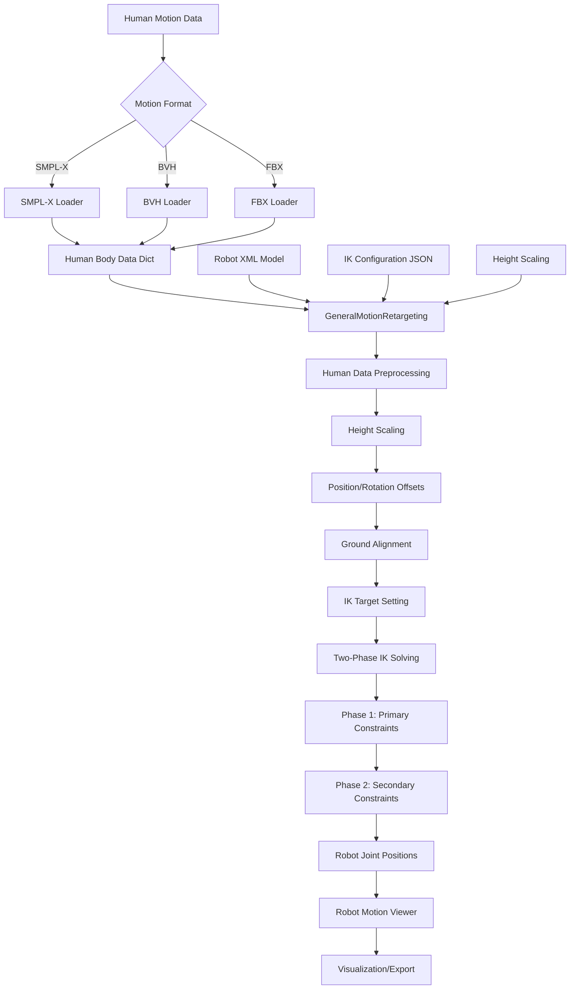
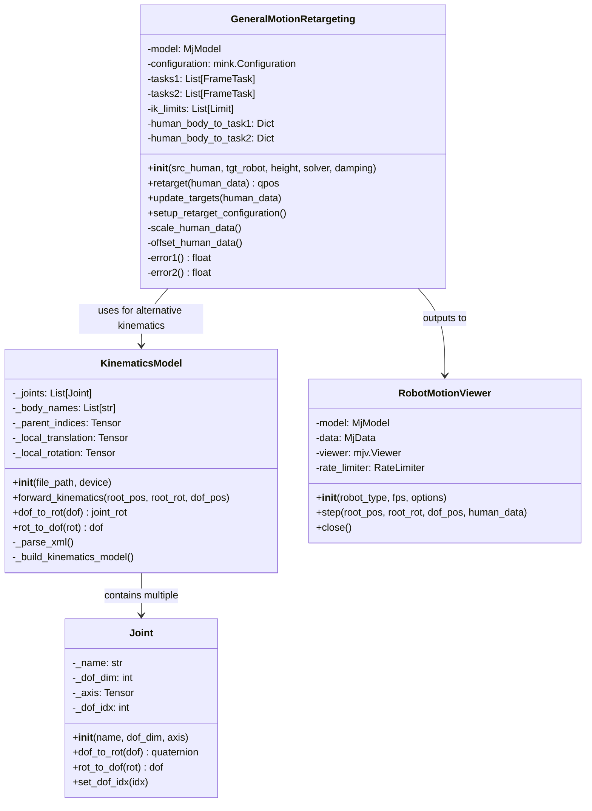
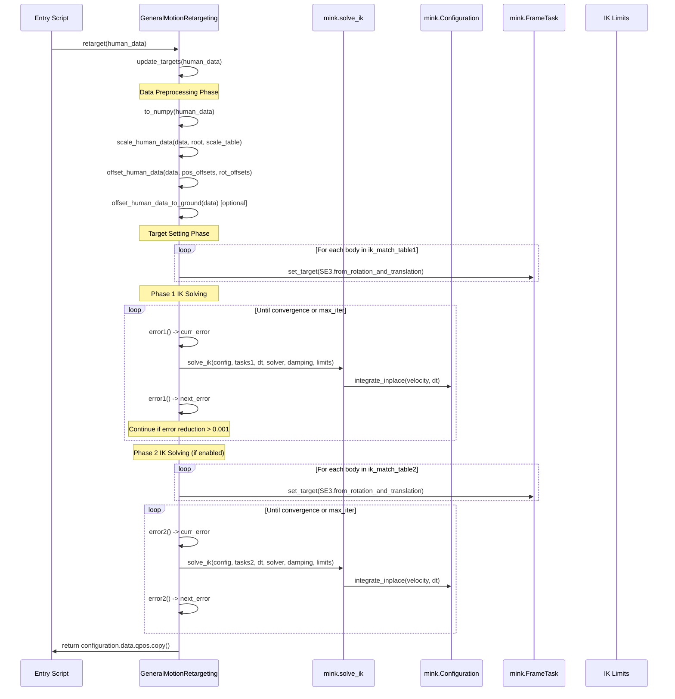

# General Motion Retargeting (GMR) - System Documentation

## Overview

GMR is a sophisticated motion retargeting system that transfers human motion data (from sources like SMPL-X, BVH, or FBX) to humanoid robot configurations using inverse kinematics (IK) solvers. The system leverages the mink library with MuJoCo physics simulation for accurate kinematic modeling and real-time motion translation.

## System Architecture

### High-Level Data Flow



### Core Component Architecture



### Detailed IK Solving Call Stack



## Theory of Operation

### 1. Motion Data Preprocessing

The system begins by preprocessing human motion data through several critical transformations:

#### Height Scaling

- **Purpose**: Adapt human motion to robot proportions
- **Method**: Scale factor = `actual_human_height / config_assumed_height`
- **Application**: Applied to position data in local coordinate frames before global transformation

#### Position and Rotation Offsets

- **Purpose**: Align human body coordinate systems with robot body coordinate systems
- **Implementation**:
  - Rotation offsets applied first using quaternion multiplication
  - Position offsets computed in local frame, then transformed to global using updated rotation
  - Formula: `global_pos = pos + R_updated.apply(local_offset)`

#### Ground Alignment

- **Purpose**: Ensure robot motion maintains ground contact
- **Method**: Find lowest foot position, offset entire motion to place feet at ground level + small offset

### 2. Two-Phase IK Solving Strategy

The system employs a hierarchical two-phase approach to handle the complexity of full-body retargeting:

#### Phase 1: Primary Constraints (ik_match_table1)

- **Focus**: Critical body parts with high position weights (typically pelvis, feet)
- **Weights**: High position weights (100), moderate rotation weights (10-50)
- **Purpose**: Establish stable base pose and foot placement

#### Phase 2: Secondary Constraints (ik_match_table2)

- **Focus**: Refined positioning of all body parts
- **Weights**: Balanced position/rotation weights (5-50)
- **Purpose**: Fine-tune arm positions, torso orientation, and overall pose quality

### 3. IK Configuration System

Each robot has detailed configuration files that define:

```json
{
  "robot_root_name": "pelvis",
  "human_root_name": "pelvis", 
  "ground_height": 0.0,
  "human_height_assumption": 1.8,
  "human_scale_table": {
    "body_name": scale_factor
  },
  "ik_match_table1": {
    "robot_frame": [
      "human_body_name",
      position_weight,
      rotation_weight, 
      [pos_offset_x, pos_offset_y, pos_offset_z],
      [quat_w, quat_x, quat_y, quat_z]
    ]
  },
  "ik_match_table2": { /* secondary constraints */ }
}
```

#### IK Match Table Structure

- **robot_frame**: Target robot body/link name
- **human_body_name**: Source human body part
- **position_weight**: IK solver weight for position constraints (0-100)
- **rotation_weight**: IK solver weight for orientation constraints (0-50)
- **pos_offset**: Local position offset to align coordinate systems
- **quat_offset**: Quaternion rotation offset for coordinate alignment

### 4. Solver Configuration

#### Mink IK Solver Parameters

- **Solver**: "daqp" (default, changed from "quadprog" for better performance)
- **Damping**: 5e-1 (increased from 1e-2 for stability)
- **Limits**:
  - Configuration limits (joint limits from robot model)
  - Velocity limits (3π rad/s for all joints, optional)

#### Convergence Criteria

- **Error Threshold**: 0.001 reduction in total error between iterations
- **Max Iterations**: 10 per phase
- **Error Calculation**: L2 norm of concatenated task errors

### 5. Real-time Performance Optimization

The system is optimized for real-time teleoperation:

#### Performance Targets

- **Target FPS**: 60-70 FPS on high-end CPUs
- **Frame Processing**: Each retargeting call processes one motion frame
- **Memory Management**: Reuses mink.Configuration object, minimal allocations

#### Optimization Techniques

- **Incremental Solving**: Leverages previous frame solution as starting point
- **Efficient Data Structures**: Numpy arrays for bulk operations
- **Minimal Recomputation**: Caches robot model data and IK task objects

## Data Structures and Formats

### Input Motion Formats

#### SMPL-X Format

```python
{
  "body_name": (
    [x, y, z],           # 3D global position
    [w, x, y, z]         # Quaternion rotation (scalar-first)
  )
}
```

#### Robot Output Format

```python
qpos = [
  x, y, z,             # Root position (3D)
  w, x, y, z,          # Root rotation quaternion (4D) 
  joint1, joint2, ...  # Joint angles in radians (nDOF)
]
```

### Configuration Files

#### Robot Model Mapping (params.py)

- **ROBOT_XML_DICT**: Maps robot names to MuJoCo XML model files
- **IK_CONFIG_DICT**: Maps (human_format, robot) pairs to IK configuration files
- **ROBOT_BASE_DICT**: Root body names for camera tracking

## Performance Characteristics

### Computational Complexity

- **Per Frame**: O(n_joints × n_iterations × n_tasks)
- **Typical Performance**: 60-70 FPS for 29-DOF robots
- **Memory Usage**: ~50MB for loaded models and configurations

### Accuracy Metrics

- **Position Error**: Typically < 5cm for critical body parts
- **Rotation Error**: Typically < 10° for major joints
- **Convergence Rate**: 95%+ frames converge within 10 iterations

### Supported Robot Types

- Unitree G1/H1 (29-39 DOF)
- Booster T1/K1 (various DOF)
- Stanford ToddlerBot, Fourier N1, ENGINEAI PM01
- Kuavo S45, HighTorque Hi, Galaxea R1 Pro
- Berkeley Humanoid Lite

## Usage Patterns

### Single Motion Conversion

```bash
python scripts/smplx_to_robot.py \
  --smplx_file path/to/motion.pkl \
  --robot unitree_g1 \
  --save_path output/robot_motion.pkl
```

### Batch Dataset Processing

```bash
python scripts/smplx_to_robot_dataset.py  # Processes entire datasets
```

### Real-time Visualization

```bash
python scripts/vis_robot_motion.py \
  --robot unitree_g1 \
  --robot_motion_path motion.pkl \
  --record_video --video_path output.mp4
```

This system represents a robust solution for transferring complex human motions to diverse humanoid robot platforms while maintaining real-time performance and high accuracy.
