# GMR (General Motion Retargeting) System Architecture & Theory of Operation

## System Overview

GMR is a sophisticated inverse kinematics (IK) based motion retargeting system that converts human motion data from various sources (SMPL-X, BVH, OptiTrack) into humanoid robot joint configurations. The system uses the mink library with MuJoCo physics simulation for real-time IK solving.

## System Architecture Diagram

```
┌─────────────────────────────────────────────────────────────────────────────────┐
│                              GMR System Architecture                            │
└─────────────────────────────────────────────────────────────────────────────────┘

INPUT DATA SOURCES                    PROCESSING PIPELINE                 OUTPUT
┌─────────────────┐                  ┌─────────────────┐                ┌─────────────┐
│   Human Motion  │                  │                 │                │   Robot     │
│   Data Sources  │                  │  GMR Processing │                │  Control    │
└─────────────────┘                  └─────────────────┘                └─────────────┘
       │                                      │                               │
       ▼                                      ▼                               ▼

┌─────────────────┐    ┌─────────────────────────────────────────────┐    ┌─────────────┐
│  SMPL-X Files   │────│              Data Loaders                  │    │    qpos     │
│  (.npz)         │    │  - utils/smpl.py                          │    │ (7+N dims)  │
└─────────────────┘    │  - utils/lafan1.py                        │    │             │
                       │  - utils/openxr.py (placeholder)           │    │ [0:3]  root │
┌─────────────────┐    │                                           │    │       pos   │
│  BVH Files      │────│        STANDARDIZED FORMAT                │    │ [3:7]  root │
│  (LAFAN1)       │    │    {"BoneName": (pos_xyz, quat_wxyz)}     │    │       rot   │
└─────────────────┘    │                                           │    │ [7:]   dof  │
                       └─────────────────┬───────────────────────────┘    │       pos   │
┌─────────────────┐                      │                               └─────────────┘
│  OptiTrack      │──────────────────────┤                                      │
│  Real-time      │                      │                                      ▼
└─────────────────┘                      ▼                               
                                                                        ┌─────────────┐
                               ┌─────────────────┐                      │  MuJoCo     │
                               │ GeneralMotion   │                      │ Simulation  │
                               │ Retargeting     │                      │ & Viewer    │
                               │ (motion_retarg- │                      └─────────────┘
                               │ et.py)          │                             │
                               └─────────────────┘                             ▼
                                        │                                      
                               ┌────────┴─────────┐                     ┌─────────────┐
                               │                  │                     │Video Output │
                               ▼                  ▼                     │ (.mp4)      │
                                                                        └─────────────┘
              ┌─────────────────────────┐    ┌─────────────────────┐
              │    IK Configuration     │    │   Robot Models      │
              │       System            │    │    (MuJoCo XML)     │
              │                         │    │                     │
              │  ik_configs/*.json:     │    │  assets/robots/:    │
              │  • smplx_to_g1.json     │    │  • unitree_g1       │
              │  • bvh_to_g1.json       │    │  • booster_t1       │
              │  • smplx_to_h1.json     │    │  • stanford_toddy   │
              │  • ... (per robot)      │    │  • fourier_n1       │
              │                         │    │  • ... (10+ robots) │
              └─────────────────────────┘    └─────────────────────┘
```

## Core Components

### 1. Data Processing Pipeline

| Component | File | Purpose |
|-----------|------|---------|
| **SMPL-X Loader** | `utils/smpl.py` | Load SMPL-X motion files (.npz) and convert to standardized format |
| **BVH Loader** | `utils/lafan1.py` | Load BVH motion files and convert to standardized format |
| **OptiTrack Interface** | `optitrack_vendor/` | Real-time motion capture data streaming |

**Standardized Format**: All loaders convert to `{"BoneName": (position_xyz, quaternion_wxyz)}`

### 2. Motion Retargeting Engine

| Component | File | Purpose |
|-----------|------|---------|
| **GeneralMotionRetargeting** | `motion_retarget.py` | Main IK solver using mink/MuJoCo |
| **KinematicsModel** | `kinematics_model.py` | Robot kinematic calculations and forward/inverse kinematics |
| **IK Configuration** | `ik_configs/*.json` | Human-to-robot bone mappings and constraints |

### 3. Robot Support Matrix

| Robot | SMPL-X | BVH | FBX | Real-time |
|-------|--------|-----|-----|-----------|
| Unitree G1/H1 | ✅ | ✅ | ✅ | ✅ |
| Booster T1/K1 | ✅ | ✅ | ❌ | ✅ |
| Stanford ToddlerBot | ✅ | ✅ | ❌ | ✅ |
| Fourier N1 | ✅ | ✅ | ❌ | ✅ |
| EngineAI PM01 | ✅ | ✅ | ❌ | ✅ |
| Kuavo S45 | ✅ | ❌ | ❌ | ✅ |
| HighTorque Hi | ✅ | ❌ | ❌ | ✅ |
| Galaxea R1 Pro | ✅ | ❌ | ❌ | ✅ |

## Theory of Operation

### Data Flow Architecture

```
Human Motion Data → Standardization → Scaling → IK Solving → Robot Control
      (various)      (dict format)   (height)   (2-stage)    (qpos)
```

### 1. **Data Standardization Phase**
- **Input**: SMPL-X, BVH, or real-time tracking data
- **Process**: Convert to unified `{"BoneName": (pos, quat)}` dictionary
- **Output**: Frame-by-frame human pose data in standardized coordinate system

### 2. **Human Scaling Phase**
- **Height Scaling**: `ratio = actual_human_height / config_assumption`
- **Body Part Scaling**: Individual scale factors per body part from IK config
- **Coordinate Transformation**: Apply position/rotation offsets for robot coordinate system

### 3. **Two-Stage IK Solving**

The system uses a sophisticated two-stage IK approach:

#### Stage 1 (`ik_match_table1`): Primary Constraints
- **High position weights** for critical points (feet: 100, pelvis: 100)
- **Lower rotation weights** (typically 10) to allow flexibility
- **Purpose**: Establish fundamental pose structure and ground contact

#### Stage 2 (`ik_match_table2`): Refinement
- **Balanced weights** for position and orientation
- **Higher foot orientation weights** (50) for stability
- **Purpose**: Fine-tune pose details and joint orientations

### 4. **IK Configuration System**

Each robot has JSON configs defining:
```json
{
  "robot_root_name": "pelvis",           // Robot base frame
  "human_root_name": "pelvis",           // Human root bone
  "human_height_assumption": 1.8,        // Expected human height (m)
  "human_scale_table": {...},            // Per-bone scaling factors
  "ik_match_table1": {                   // Stage 1 constraints
    "robot_link": ["human_bone", pos_weight, rot_weight, pos_offset, rot_offset]
  },
  "ik_match_table2": {...}               // Stage 2 constraints
}
```

### 5. **Real-time Performance**
- **Target**: 60-70 FPS on high-end CPUs
- **IK Solver**: DAQP (default) or QuadProg with 5e-1 damping
- **Limits**: Configuration limits + velocity limits (3π rad/s per joint)
- **Convergence**: Up to 10 iterations until error reduction < 0.001

### 6. **Output Format**
- **qpos Vector**: `[root_pos(3), root_rot(4), dof_pos(N)]`
- **Coordinate System**: MuJoCo world coordinates
- **Quaternions**: WXYZ format for rotations
- **Units**: Meters for position, radians for angles

## Key Technical Features

### Adaptive Height Scaling
The system automatically scales human motion based on actual vs. assumed human height, ensuring proper proportional mapping to robot dimensions.

### Multi-Stage IK Optimization  
Two-stage solving allows prioritizing critical constraints (ground contact, balance) while refining secondary objectives (joint orientations).

### Modular Data Source Support
Clean abstraction allows easy addition of new motion capture sources by implementing the standardized dictionary format.

### Real-time Capability
Optimized IK solving with configurable convergence criteria enables teleoperation applications at 60+ FPS.

---

## OpenXR Integration Analysis

> How difficult do you think it is to add OpenXR full body pose definition as a data source type?

● Based on my analysis of the GMR codebase, adding OpenXR full body pose as a data source would be
   **Low-Medium difficulty** - probably 1-2 weeks of development work.

  **Why it's relatively straightforward:**

  The architecture is well-designed for this:
  - All data sources convert to the same standardized format: `{"BoneName": (position, orientation), ...}`
  - Real-time data streaming already exists (OptiTrack integration)
  - OpenXR bone definitions are already documented in References/openxr_skeletons.py

  **What you'd need to implement:**

  1. OpenXR data loader (`utils/openxr.py`) - Convert OpenXR skeletal data to the standard dictionary format
  2. Real-time script (`scripts/openxr_to_robot.py`) - Similar to existing `optitrack_to_robot.py`
  3. IK configuration files - Map OpenXR's 84 FullBody bones to robot joints (`ik_configs/openxr_to_g1.json`)
  4. Update GMR initialization to accept `src_human="openxr"`

  **Main challenges:**

  - Coordinate system alignment between OpenXR and existing conventions
  - Bone hierarchy mapping from OpenXR's 84 bones to SMPL-X expectations
  - Hardware dependency on OpenXR-compatible tracking devices
  - Latency optimization for real-time performance

  **Key advantage:**

  The codebase already shows OpenXR consideration (the reference file exists) and has proven
  real-time data stream handling, making this a natural extension rather than a fundamental
  architecture change.

> Does your answer change if we only care about teleoperation from pre-recorded data, for the time being?

● Yes, it becomes significantly easier - dropping from **1-2 weeks to 2-3 days** of development work.

  **What gets much simpler:**

  **No real-time complexity:**
  - No hardware dependencies or device drivers
  - No latency optimization needed
  - No streaming data handling
  - Just file parsing, like existing BVH/SMPL-X workflows

  **Reduced scope:**
  - Only need `load_openxr_file()` function in utils/openxr.py
  - Single script `scripts/openxr_to_robot.py` (batch processing)
  - Standard IK config file `ik_configs/openxr_to_g1.json`

  **Implementation would be:**

  1. **Data loader (1 day)** - Parse OpenXR file format → standard dict format
  2. **IK mapping (1-2 days)** - Map OpenXR's FullBody bones to robot joints
  3. **Integration (half day)** - Wire into existing GMR workflow

  **Main remaining challenge:**

  Just the bone hierarchy mapping from OpenXR's 84 FullBodyBoneId joints to what the robots expect. But you can leverage the existing SMPL-X and BVH mappings as templates.

  **File format assumption:**

  Assuming OpenXR data comes in some standard format (JSON, binary, etc.) with per-frame bone poses. If it's a custom format, add another day for reverse engineering.

  This becomes a very straightforward extension of the existing offline processing pipeline.

---

## SMPL-X Global Orientation (`global_orient`) Explanation

In the context of `general_motion_retargeting/utils/smpl.py`, **`global_orient`** refers to the **root body orientation** of the SMPL-X human model:

### Definition
- **Representation**: 3D rotation vector in axis-angle format (shape: `(N, 3)` for N frames)
- **Source**: Extracted from SMPL-X data as `smplx_data["root_orient"]` 
- **Purpose**: Defines the global orientation of the entire human body in world space

### Technical Details
- **Root Joint**: Corresponds to the pelvis/hip joint - the base reference frame for the human body
- **Coordinate System**: Establishes the global coordinate frame from which all other body parts are positioned and oriented
- **Usage in Pipeline**: 
  - Gets converted to rotation matrices using `R.from_rotvec(global_orient)`
  - Used as the base transformation for computing absolute positions and orientations of all body joints
  - Critical for proper scaling and coordinate system alignment when retargeting to robots

### Key Role in Motion Retargeting
The `global_orient` serves as the **foundational transformation** that:
1. Positions the human model correctly in 3D world space
2. Provides the reference orientation for computing relative joint rotations
3. Enables proper coordinate system mapping between human motion data and robot kinematics
4. Supports height scaling and ground alignment operations in the retargeting pipeline

This parameter is essential for maintaining spatial coherence when converting human motion data into robot joint configurations through the GMR system's two-stage IK solving process.

---

## GeneralMotionRetargeting Deep Dive (`motion_retarget.py`)

This section provides a detailed technical analysis of how the core `GeneralMotionRetargeting` class implements the IK-based motion retargeting system.

### Class Architecture Overview

```mermaid
graph TD
    subgraph "Initialization Phase"
        A[Load Robot XML Model] --> B[Extract DoF/Body/Motor Names]
        B --> C[Load IK Configuration JSON]
        C --> D[Apply Human Height Scaling]
        D --> E[Setup Two-Stage Task System]
    end
    
    subgraph "Configuration Setup"
        E --> F[Create mink.Configuration]
        F --> G[Setup Stage 1 Tasks<br/>ik_match_table1]
        G --> H[Setup Stage 2 Tasks<br/>ik_match_table2]
        H --> I[Apply Position/Rotation Offsets]
    end
    
    subgraph "Runtime Retargeting Loop"
        J[Human Motion Data<br/>Dict Format] --> K[Data Preprocessing]
        K --> L[to_numpy Transform]
        L --> M[Height/Scale Transform]
        M --> N[Position/Rotation Offsets]
        N --> O{Ground Offset?}
        O -->|Yes| P[Offset to Ground]
        O -->|No| Q[Update Task Targets]
        P --> Q
        
        Q --> R{Stage 1 Enabled?}
        R -->|Yes| S[Stage 1 IK Solving<br/>Primary Constraints]
        R -->|No| U{Stage 2 Enabled?}
        S --> T[Iterative Convergence<br/>max 10 iterations]
        T --> U
        U -->|Yes| V[Stage 2 IK Solving<br/>Refinement]
        U -->|No| Y[Return qpos]
        V --> W[Iterative Convergence<br/>max 10 iterations] 
        W --> Y
    end
    
    I --> J
```



### Key Components and Data Structures

#### 1. **Initialization System** (`__init__`)

The constructor performs several critical setup operations:

```python
# Core setup sequence from motion_retarget.py:13-104
def __init__(self, src_human, tgt_robot, actual_human_height=None, ...):
    # 1. Robot Model Loading
    self.xml_file = ROBOT_XML_DICT[tgt_robot]
    self.model = mj.MjModel.from_xml_path(self.xml_file)
    
    # 2. Extract Robot Structure
    self.robot_dof_names = {}    # DoF name → index mapping  
    self.robot_body_names = {}   # Body name → ID mapping
    self.robot_motor_names = {}  # Motor name → ID mapping
    
    # 3. Load & Scale IK Configuration
    ik_config = json.load(IK_CONFIG_DICT[src_human][tgt_robot])
    ratio = actual_human_height / ik_config["human_height_assumption"]
    # Apply scaling to human_scale_table
```

**Key Data Structures Created:**
- `robot_dof_names`: Maps joint names to DoF indices for MuJoCo
- `robot_body_names`: Maps body frame names to MuJoCo body IDs  
- `robot_motor_names`: Maps actuator names to motor indices
- `ik_match_table1/2`: Two-stage constraint definitions
- `human_scale_table`: Per-bone scaling factors (adjusted for human height)

#### 2. **Two-Stage Task System** (`setup_retarget_configuration`)

The system creates two distinct sets of IK tasks:

```python
# Stage 1: Primary constraints (high position weights, low rotation weights)
for frame_name, entry in self.ik_match_table1.items():
    body_name, pos_weight, rot_weight, pos_offset, rot_offset = entry
    task = mink.FrameTask(
        frame_name=frame_name,
        position_cost=pos_weight,     # Typically 100 for feet/pelvis
        orientation_cost=rot_weight,   # Typically 10 for flexibility
    )
    
# Stage 2: Refinement (balanced weights)  
for frame_name, entry in self.ik_match_table2.items():
    # Similar setup with different weight distributions
```

**Stage 1 (`ik_match_table1`)**: Establishes fundamental pose structure
- **High position weights** (100) for critical points: feet, pelvis
- **Lower rotation weights** (10) for joint flexibility
- **Purpose**: Ground contact, basic pose structure, stability

**Stage 2 (`ik_match_table2`)**: Fine-tunes pose details
- **Balanced position/rotation weights** 
- **Higher foot orientation weights** (50) for walking stability
- **Purpose**: Joint orientations, pose refinement, natural appearance

#### 3. **Data Processing Pipeline**

The retargeting process transforms human motion through several stages:

```python
def retarget(self, human_data, offset_to_ground=False):
    # 1. Data Standardization
    human_data = self.to_numpy(human_data)           # Ensure numpy arrays
    
    # 2. Scaling Transformation  
    human_data = self.scale_human_data(
        human_data, self.human_root_name, self.human_scale_table
    )
    
    # 3. Offset Application
    human_data = self.offset_human_data(
        human_data, self.pos_offsets1, self.rot_offsets1
    )
    
    # 4. Optional ground alignment
    if offset_to_ground:
        human_data = self.offset_human_data_to_ground(human_data)
```

#### 4. **Scaling System** (`scale_human_data`)

Height-adaptive scaling ensures proper proportional mapping:

```python
def scale_human_data(self, human_data, human_root_name, human_scale_table):
    # Transform to local coordinates relative to root
    root_pos, root_quat = human_data[human_root_name]
    scaled_root_pos = human_scale_table[human_root_name] * root_pos
    
    # Scale each body part in local frame
    for body_name in human_data.keys():
        if body_name != human_root_name:
            local_pos = (human_data[body_name][0] - root_pos) * scale_factor
    
    # Transform back to global coordinates with scaled root
```

**Key Features:**
- **Root scaling**: Scales pelvis position by height ratio
- **Local frame scaling**: Each bone scaled independently in local coordinates  
- **Coordinate preservation**: Maintains relative bone relationships
- **Per-bone factors**: Different scaling for legs (0.9) vs arms (0.8)

#### 5. **Two-Stage IK Solving Process**

The heart of the system uses iterative optimization:

```python
# Stage 1 Solving
if self.use_ik_match_table1:
    curr_error = self.error1()
    dt = self.configuration.model.opt.timestep
    
    # Initial solve
    vel1 = mink.solve_ik(self.configuration, self.tasks1, dt, 
                         self.solver, self.damping, self.ik_limits)
    self.configuration.integrate_inplace(vel1, dt)
    
    # Iterative refinement (up to 10 iterations)
    while curr_error - next_error > 0.001 and num_iter < self.max_iter:
        # Continue solving until convergence or max iterations
```

**Convergence Criteria:**
- **Error threshold**: 0.001 reduction between iterations
- **Max iterations**: 10 per stage
- **Solver options**: DAQP (default) or QuadProg  
- **Damping**: 5e-1 for stability vs speed balance

#### 6. **Constraint System**

The system enforces several types of constraints:

```python
self.ik_limits = [
    mink.ConfigurationLimit(self.model),  # Joint angle limits from URDF
]
if use_velocity_limit:
    VELOCITY_LIMITS = {k: 3*np.pi for k in self.robot_motor_names.keys()}
    self.ik_limits.append(mink.VelocityLimit(self.model, VELOCITY_LIMITS))
```

**Constraint Types:**
- **Configuration limits**: Joint angle bounds from robot model
- **Velocity limits**: 3π rad/s maximum joint velocity (optional)
- **Position constraints**: Target positions for body frames
- **Orientation constraints**: Target orientations for body frames

### Performance Characteristics

#### Real-time Optimization
- **Target framerate**: 60-70 FPS on high-end CPUs
- **Solver performance**: DAQP typically faster than QuadProg
- **Convergence speed**: Usually converges in 2-4 iterations per stage
- **Memory efficiency**: Reuses configuration object across frames

#### Accuracy vs Speed Tradeoffs
- **High damping** (5e-1): More stable, slower convergence
- **Low damping** (1e-2): Faster convergence, potential instability  
- **Two-stage approach**: Primary constraints first, refinement second
- **Adaptive iteration**: Stops early when error reduction drops below threshold

### Integration Points

The class integrates with the broader GMR system through:

1. **Input standardization**: Accepts `{"BoneName": (pos, quat)}` format
2. **Configuration loading**: Uses JSON files from `ik_configs/` directory
3. **Robot model loading**: Loads MuJoCo XML models from `assets/` directory
4. **Output format**: Returns MuJoCo `qpos` vector for simulation/control

This architecture enables the system to handle diverse input sources (SMPL-X, BVH, OpenXR) while maintaining consistent output for any supported robot platform.

# CLAUDE.md

This file provides guidance to Claude Code (claude.ai/code) when working with code in this repository.

## Installation and Setup

This is a Python package for motion retargeting to humanoid robots. Install in development mode:

```bash
conda create -n gmr python=3.10 -y
conda activate gmr
pip install -e .
conda install -c conda-forge libstdcxx-ng -y
```

## Code Architecture

### Core Components

- **`GeneralMotionRetargeting`** (`general_motion_retargeting/motion_retarget.py`): Main class for motion retargeting using inverse kinematics (IK) solver built on mink/mujoco
- **`KinematicsModel`** (`general_motion_retargeting/kinematics_model.py`): Handles robot kinematics calculations
- **`RobotMotionViewer`** (`general_motion_retargeting/robot_motion_viewer.py`): MuJoCo-based visualization for robot motions
- **Configuration System** (`general_motion_retargeting/params.py`): Simplified robot definitions and IK config mappings - cleaned to focus on core supported robots

### Data Flow

1. **Human Motion Input**: SMPL-X (AMASS/OMOMO) or BVH (LAFAN1) format
2. **Motion Format**: Each frame = dict of (human_body_name, 3D translation + rotation)
3. **Robot Output**: Tuple of (base_translation, base_rotation, joint_positions)
4. **IK Configs**: JSON files in `general_motion_retargeting/ik_configs/` define human-to-robot body mappings

### Supported Robots

Core robot models in `assets/` directory:
- Unitree G1 (`unitree_g1`)
- Booster T1 (`booster_t1`)
- Stanford ToddlerBot (`stanford_toddy`) 
- Fourier N1 (`fourier_n1`)
- ENGINEAI PM01 (`engineai_pm01`)
- Kuavo S45 (`kuavo_s45`)
- HighTorque Hi (`hightorque_hi`)
- Galaxea R1 Pro (`galaxea_r1pro`)

Additional models retained in ROBOT_BASE_DICT for compatibility:
- `unitree_g1_with_hands`, `dex31_left_hand`, `dex31_right_hand`

## Common Commands

### Single Motion Retargeting
```bash
# SMPL-X to robot
python scripts/smplx_to_robot.py --smplx_file <path> --robot <robot_name> --save_path <output.pkl>

# BVH to robot  
python scripts/bvh_to_robot.py --bvh_file <path> --robot <robot_name> --save_path <output.pkl>
```

### Batch Processing
```bash
# Process datasets
python scripts/smplx_to_robot_dataset.py
python scripts/bvh_to_robot_dataset.py
```

### Visualization
```bash
# Visualize saved robot motion
python scripts/vis_robot_motion.py --robot <robot_name> --robot_motion_path <path.pkl>
```

Add `--record_video --video_path <output.mp4>` to any visualization command to record video.

## Key Technical Details

- **IK Solver**: Uses mink library with configurable solver (default: "daqp") and damping (default: 5e-1)
- **Human Height Scaling**: Automatic scaling based on `actual_human_height` parameter vs config assumptions
- **Real-time Performance**: Optimized for 60-70 FPS on high-end CPUs for teleoperation use cases
- **Body Model Dependencies**: Requires SMPL-X body models in `assets/body_models/smplx/`

## File Organization

- `scripts/`: Entry point scripts for different retargeting workflows
- `general_motion_retargeting/`: Core library code
- `assets/`: Robot models (MuJoCo XML) and body models (SMPL-X)
- `general_motion_retargeting/ik_configs/`: JSON configuration files for human-to-robot body mappings:
  - SMPL-X configs: `smplx_to_{g1,t1,toddy,n1,pm01,kuavo,hi,r1pro}.json`
  - BVH configs: `bvh_to_{g1,t1,toddy,n1,pm01}.json`
  - FBX configs: `fbx_to_g1.json`